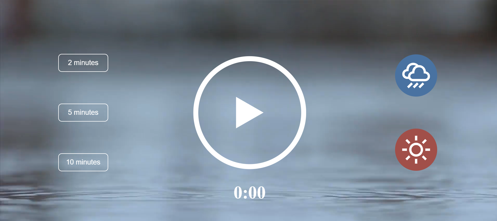
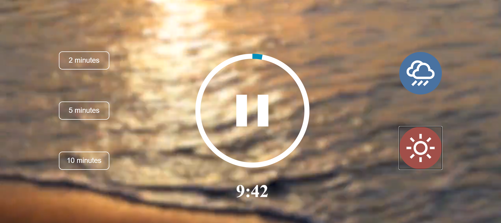

# Meditation App

This is a meditation app which helps meditators by playing soothing music from a list of available options. The app is built using CSS, HTML and Vanilla Javascript. I made use of some SVGs present on the internet in my app.

## Features:

The app has following features:
* It has 3 pre-fixed timers of 2, 3 & 5 minutes. On using any one of these, the timer would automatically start for the desired options.
* There are 2 sounds, one is of rainfall and other is of beach waves. Based on the option choosen, the landscape of the app also changes.

## Screenshots:

